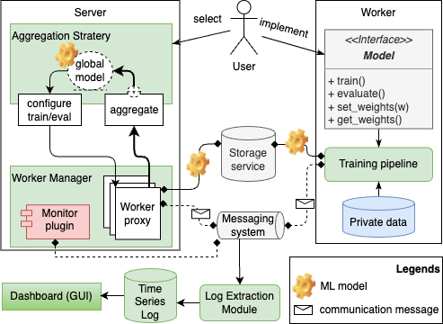

# Asyn2F
We develop an asynchronous federated learning framework, named Asyn2F, with bidirectional model aggregation. 
By bidirectional model aggregation, on one hand, allows the server to asynchronously aggregate multiple local models and generate a new global model. 
On the other hand, it allows the training workers to aggregate the new version of the global model into the local model, which is being trained even in the middle of a training epoch. 
We develop Asyn2F considering the practical implementation requirements such as using cloud services for model storage and message queuing protocols for communications.

The general architecture of Asyn2F is described as below.

And here is the sequence diagram

## Prerequisites - Machine
1. A public server for message queue (RabbitMQ) and storage service (i.e., minio) 
2. A machine/server plays the role of federated server.
3. Edges for federated workers
4. InlfuxDB and Grafana account if you want to real-time monitor

## Setting up the development environment
NOTE: we test our platform on Ubuntu 22.04 and Python >=3.9
1. On public server, we recommend to use Docker to run RabbitMQ and MinIO. You may install and run them on your server environment.
2. On federated server and workers, please run "python3 setup.py install" to install all dependencies.
3. Create a .env from .env_template and at least setup the parameter of minio and rabbitmq.

## Run ember experiment
1. start Docker of rabbitmq and minio on public server.
2. create config for federated server and workers (see samples in experiment folder to configure queue, minio, and other training params).
3. start federated server "python experiment/ember_dataset/7_chunks_non_iid/server/run_server.py --config_file=???"
4. start federated worker "python experiment/ember_dataset/7_chunks_non_iid/client/run_client.py --config_file=???"
